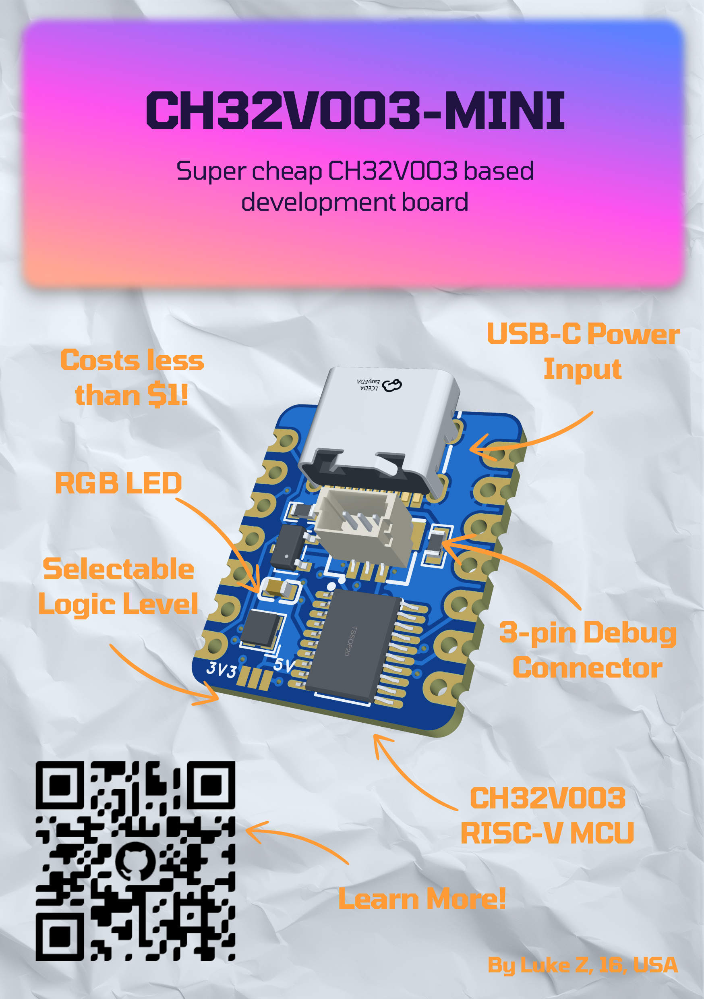
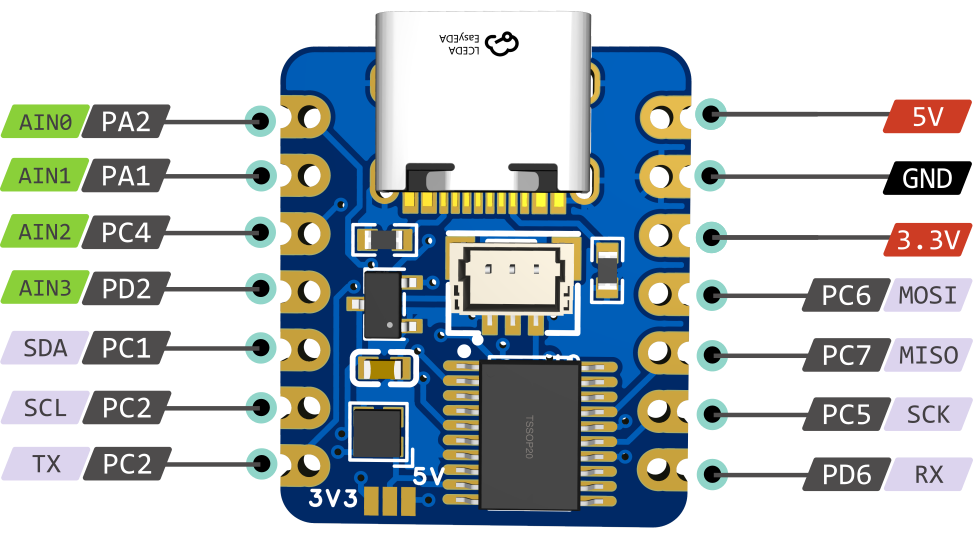
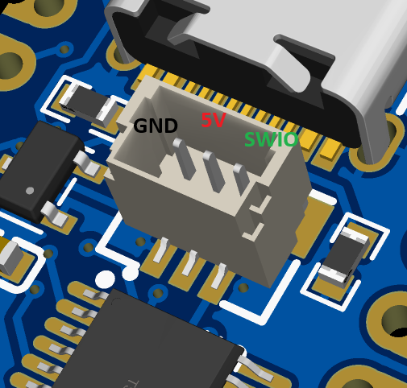
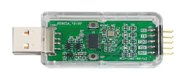
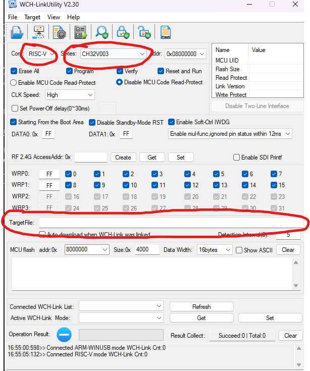

# CH32V003 Based Dev Board

## What is this?
This is a low cost CH32V003 powered development board based on  the seeed studio XIAO.
## Why did I make it?
I recently began building freeform wire sculptures using the CH32V003 for its low cost and sufficient capabilities, but soldering straight to the chip wasn't elegant. I wanted something like the seeed studio XIAO, but cheaper. Each board costs **less than $1**
# Features
- 32-bit RISC-V MCU @ 48MHZ
- 2KB SRAM + 16KB Flash
- Selectable 3.3v or 5v logic level
- Embedded SK6812 RGB LED
- 11 GPIO
- 1x USART
- 1x SPI
- 1x I2C
- 4x 10-bit Analog Input
- 1-wire Serial Debug Interface

## Bill of Materials
| Part | Qty (per board) | Purchase Link | Price (@ 50 units) | 
| ---- | --------------- | ------------- | ------------------ |
| CH32V003F4P6 | 1 | [LCSC](https://www.lcsc.com/product-detail/C5187096.html) | $0.22 |
| USB C Connector | 1 | [LCSC](https://www.lcsc.com/product-detail/C165948.html) | $0.1345 |
| 3.3v LDO | 1 | [LCSC](https://www.lcsc.com/product-detail/C347376.html) | $0.0157 |
| SK6812 LED | 1 | [LCSC](https://www.lcsc.com/product-detail/C2909058.html) | $0.0903 |
| 5.1k 0603 Resistor | 2 | [LCSC](https://www.lcsc.com/product-detail/C2907114.html) | $0.001 |
| 100nF capacitor | 1 | [LCSC](https://www.lcsc.com/product-detail/C24452.html) | $0.0095 |
| JST SH connector (optional) | 1 | [LCSC](https://www.lcsc.com/product-detail/C160389.html) | $0.2209 |
| PCB (lead free) | 1 | JLCPCB | $0.304 |
| PCB (with lead) |  | JLCPCB | $0.204 |
#### Total Cost Per Board:
- Lead Free & With JST SH Connector: **$1**[^1]   
- NOT Lead Free & Without JST SH Connector:  **$0.68**[^1]
## How to use it
### Pinout
The pinout matches that of [seeed studio XIAO](https://wiki.seeedstudio.com/SeeedStudio_XIAO_Series_Introduction/) boards.
 
 

### Logic Voltage
The board is configurable for 3.3v or 5v logic voltage. Solder the jumper pad on the bottom to switch between them. Digital inputs will remain 5v tolerant.
### Programming
Programming is based on [ch32fun](https://github.com/cnlohr/ch32fun). Refer to it for supported programmers, etc.    
Using a JST SH connector, connect the wires to the appropriate pins on the debugger of your choice   
      
#### If you do not want to use the JST connector, connect the appropriate power pins on the board and connect SWIO to the pin hidden below the connector.
### My setup
#### Programming can be difficult to get working, so here is what my setup is to make it work.   
I use the [**WCH LinkE**](https://www.aliexpress.us/item/3256804695267285.html) programmer. I haven't gotten it to work with minichlink from ch32fun, so I use [**WCH-LinkUtility**](https://www.wch.cn/downloads/wch-linkutility_zip.html) to flash the `.hex` file onto the board    

[^1]: Price estimates exclude shipping costs
